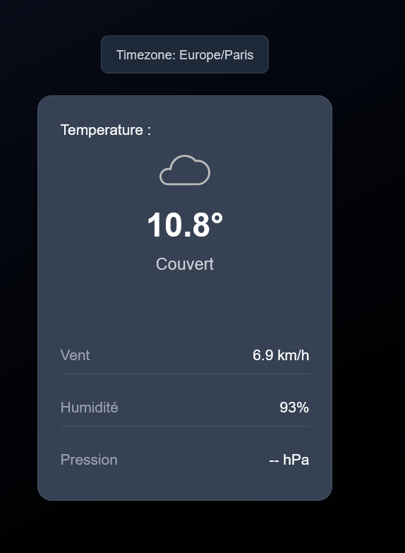

# Weather App 

## Objective

Build a weather application twice: first with vanilla JavaScript to master fundamentals, then with Next.js and TypeScript to learn modern React development. This approach taught me API integration, geolocation, state management, and conditional rendering from both basic and advanced perspectives.

## Project Overview

A responsive weather app that displays real-time conditions using the Open-Meteo API. The vanilla version focuses on core web technologies - fetch API, DOM manipulation, and browser geolocation. The Next.js version implements the same features using React hooks, TypeScript interfaces, and server-side rendering capabilities, providing a comparison between traditional and modern web development approaches.

## What i learned 🧠

I gained a solid understanding about DOM in javascript, how to interect with different API, how to handle errors effectively, it taught how to really solve a problem by myself through docs and apply differents concept as fetch(), .then(), response.json(). On the other hand, with React and Typescript i mainly learn about how to handle different state variables.
